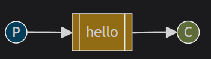
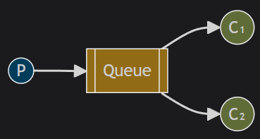
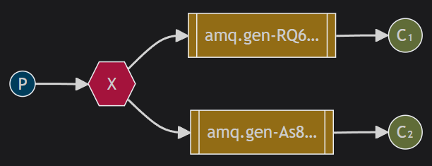
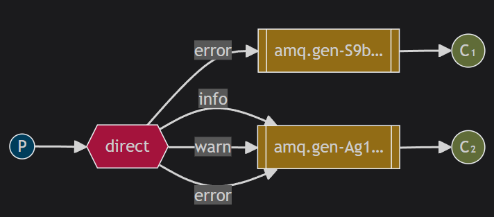
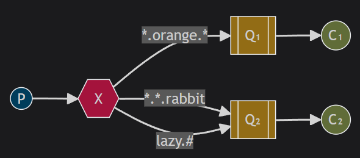
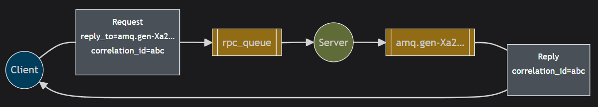

### RabbitMQ tutorial

- https://www.rabbitmq.com/tutorials/tutorial-one-python

### Tutorial 1

- https://www.rabbitmq.com/tutorials/tutorial-one-python
  

### Tutorial 2

- https://www.rabbitmq.com/tutorials/tutorial-two-python
  

### Tutorial 3

- https://www.rabbitmq.com/tutorials/tutorial-three-python
  

### Tutorial 4

- https://www.rabbitmq.com/tutorials/tutorial-four-python
  

### Tutorial 5

- https://www.rabbitmq.com/tutorials/tutorial-five-python
  

### Tutorial 6

- https://www.rabbitmq.com/tutorials/tutorial-six-python
  
